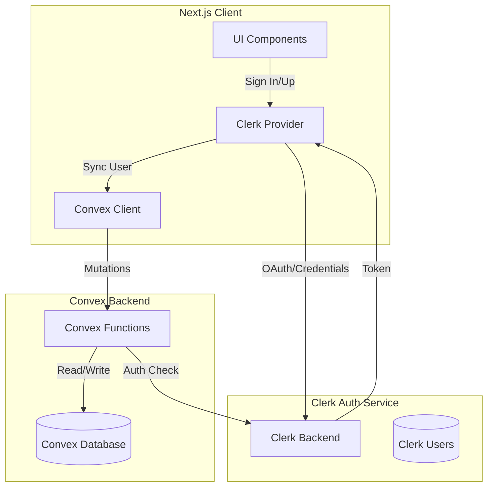

# Authentication Architecture Plan

## Overview

This document outlines the complete authentication architecture for Samiati, integrating Clerk for authentication with Convex as the backend database.

---

## Current State Analysis

### Existing Infrastructure
| Component | Status | Location |
|-----------|--------|----------|
| Clerk SDK | ✅ Installed | `package.json` |
| Clerk Integration | ✅ Partial | `src/app/ConvexClientProvider.tsx` |
| Convex Auth Config | ✅ Configured | `convex/auth.config.ts` |
| Users Schema | ✅ Defined | `convex/schema.ts` (clerkId field) |
| User Sync Mutation | ✅ Implemented | `convex/users/mutations.ts` (store function) |
| Auth Screens | ⚠️ Placeholder | `src/app/auth/[slug]/page.tsx` |
| Welcome Screen | ✅ UI Only | `src/components/screens/WelcomeScreen.tsx` |

### Gaps Identified
1. **Missing Environment Variables** - No Clerk keys configured
2. **No Dedicated Sign-In Page** - Uses placeholder routes
3. **No Dedicated Sign-Up Page** - Uses placeholder routes  
4. **Social Login Not Connected** - Buttons exist but no Clerk integration
5. **Password Reset Flow Incomplete** - Only UI components, no logic
6. **Protected Routes Not Implemented** - No auth guards on dashboard
7. **Guest Mode Logic Missing** - UI exists but no auth state handling

---

## Architecture Diagram



---

## Implementation Plan

### Phase 1: Environment Setup

#### 1.1 Environment Variables
Create `.env.local` with required Clerk variables:

```env
# Clerk Configuration
NEXT_PUBLIC_CLERK_PUBLISHABLE_KEY=pk_test_...
CLERK_SECRET_KEY=sk_test_...
NEXT_PUBLIC_CLERK_SIGN_IN_URL=/sign-in
NEXT_PUBLIC_CLERK_SIGN_UP_URL=/sign-up
NEXT_PUBLIC_CLERK_AFTER_SIGN_IN_URL=/dashboard
NEXT_PUBLIC_CLERK_AFTER_SIGN_UP_URL=/dashboard
CLERK_ISSUER_URL=https://your-issuer.clerk.accounts.dev

# Convex
NEXT_PUBLIC_CONVEX_URL=https://your-deployment.convex.cloud
```

#### 1.2 Clerk Dashboard Configuration
1. Create Clerk application at clerk.com
2. Configure OAuth providers (Google, Facebook)
3. Enable username/email sign-in
4. Configure password reset settings
5. Set up webhook for user events (optional)

---

### Phase 2: Authentication Pages

#### 2.1 Sign-In Page (`/sign-in`)
```typescript
// Implementation approach: Use Clerk's <SignIn /> component
// Location: src/app/sign-in/[[...sign-in]]/page.tsx

import { SignIn } from "@clerk/nextjs";

export default function SignInPage() {
  return (
    <div className="auth-container">
      <SignIn 
        appearance={{
          elements: {
            rootBox: "auth-root",
            card: "auth-card"
          }
        }}
        routing="path"
        signUpUrl="/sign-up"
        redirectUrl="/dashboard"
      />
    </div>
  );
}
```

#### 2.2 Sign-Up Page (`/sign-up`)
```typescript
// Implementation approach: Use Clerk's <SignUp /> component
// Location: src/app/sign-up/[[...sign-up]]/page.tsx

import { SignUp } from "@clerk/nextjs";

export default function SignUpPage() {
  return (
    <div className="auth-container">
      <SignUp 
        appearance={{
          elements: {
            rootBox: "auth-root",
            card: "auth-card"
          }
        }}
        routing="path"
        signInUrl="/sign-in"
        redirectUrl="/dashboard"
      />
    </div>
  );
}
```

---

### Phase 3: Social Login Integration

#### 3.1 Google OAuth
- Enable in Clerk Dashboard
- Configure OAuth redirect URIs
- No additional code needed - handled by Clerk

#### 3.2 Facebook OAuth  
- Enable in Clerk Dashboard
- Configure OAuth redirect URIs
- No additional code needed - handled by Clerk

#### 3.3 Update Welcome Screen
```typescript
// Modify src/components/screens/WelcomeScreen.tsx
// Add Clerk handlers for social login buttons

import { useSignIn, useSignUp } from "@clerk/nextjs";
import { useRouter } from "next/navigation";

// In component:
const { signIn, isLoaded: signInLoaded } = useSignIn();
const { signUp, isLoaded: signUpLoaded } = useSignUp();
const router = useRouter();

const handleGoogleSignIn = () => {
  signIn.authenticateWithRedirect({
    strategy: "oauth_google",
    redirectUrl: "/dashboard"
  });
};

const handleFacebookSignIn = () => {
  signIn.authenticateWithRedirect({
    strategy: "oauth_facebook", 
    redirectUrl: "/dashboard"
  });
};
```

---

### Phase 4: Password Reset Flow

#### 4.1 Forgot Password Page
```typescript
// src/app/forgot-password/page.tsx
// Use Clerk's <ClerkForgotPassword> or custom form with API

import { useClerk } from "@clerk/nextjs";

export default function ForgotPasswordPage() {
  const { handleForgotPassword } = useClerk();
  
  // Option 1: Use Clerk's hosted flow
  // Option 2: Custom form calling Clerk API
}
```

#### 4.2 Reset Password Page
```typescript
// src/app/reset-password/page.tsx
// Verify token and update password
```

#### 4.3 Password Changed Confirmation
- Already exists: `src/app/auth/password-changed/page.tsx`

---

### Phase 5: Protected Routes

#### 5.1 Auth Guard Component
```typescript
// src/components/auth/AuthGuard.tsx

"use client";

import { useAuth } from "@clerk/nextjs";
import { useRouter } from "next/navigation";
import { useEffect } from "react";

interface AuthGuardProps {
  children: React.ReactNode;
  fallback?: React.ReactNode;
}

export function AuthGuard({ children, fallback }: AuthGuardProps) {
  const { userId, isLoaded } = useAuth();
  const router = useRouter();

  useEffect(() => {
    if (isLoaded && !userId) {
      router.push("/sign-in");
    }
  }, [isLoaded, userId, router]);

  if (!isLoaded) {
    return <div>Loading...</div>;
  }

  if (!userId && fallback) {
    return <>{fallback}</>;
  }

  return <>{children}</>;
}
```

#### 5.2 Dashboard Route Protection
```typescript
// src/app/dashboard/layout.tsx

import { AuthGuard } from "@/components/auth/AuthGuard";

export default function DashboardLayout({
  children,
}: {
  children: React.ReactNode;
}) {
  return (
    <AuthGuard>
      {children}
    </AuthGuard>
  );
}
```

#### 5.3 Guest Mode Support
```typescript
// For routes that allow both authenticated and guest users

interface GuestGuardProps {
  children: React.ReactNode;
  requireAuth?: boolean;
}

export function GuestGuard({ children, requireAuth = false }: GuestGuardProps) {
  const { userId, isLoaded } = useAuth();
  
  if (requireAuth && !userId && isLoaded) {
    router.push("/sign-in");
  }
  
  return <>{children}</>;
}
```

---

### Phase 6: User State Management

#### 6.1 Enhanced User Sync
```typescript
// src/app/ConvexClientProvider.tsx - Enhanced

"use client";

import { ReactNode, useEffect, useState } from "react";
import { ClerkProvider, useAuth, useUser } from "@clerk/nextjs";
import { ConvexReactClient } from "convex/react";
import { ConvexProviderWithClerk } from "convex/react-clerk";
import { api } from "../../convex/_generated/api";

const convexUrl = process.env.NEXT_PUBLIC_CONVEX_URL;
const convex = convexUrl ? new ConvexReactClient(convexUrl) : null;

function UserSync() {
  const { userId } = useAuth();
  const { user: clerkUser } = useUser();
  const storeUser = useMutation(api.users.mutations.store);
  const [hasSynced, setHasSynced] = useState(false);

  useEffect(() => {
    if (userId && clerkUser && !hasSynced) {
      storeUser({
        name: clerkUser.fullName || clerkUser.firstName || "User",
        handle: clerkUser.username || `user_${clerkUser.id.slice(0, 8)}`,
        avatar: clerkUser.imageUrl,
        email: clerkUser.primaryEmailAddress?.emailAddress,
      }).then(() => setHasSynced(true));
    }
  }, [userId, clerkUser, storeUser, hasSynced]);

  return null;
}

export default function ConvexClientProvider({ children }: { children: ReactNode }) {
  if (!convexUrl || !convex) {
    return <>{children}</>;
  }

  return (
    <ClerkProvider>
      <ConvexProviderWithClerk client={convex} useAuth={useAuth}>
        <UserSync />
        {children}
      </ConvexProviderWithClerk>
    </ClerkProvider>
  );
}
```

#### 6.2 User Context Hook
```typescript
// src/hooks/useCurrentUser.ts

"use client";

import { useQuery } from "convex/react";
import { api } from "../../convex/_generated/api";

export function useCurrentUser() {
  const user = useQuery(api.users.queries.getProfile);
  return user;
}
```

---

### Phase 7: Route Structure

```
/                           → WelcomeScreen (landing)
/sign-in                    → Clerk SignIn component
/sign-up                    → Clerk SignUp component  
/forgot-password            → Password reset request
/reset-password             → Password reset (token from email)
/dashboard                  → Protected: Main app
/dashboard/profile          → Protected: User profile
/dashboard/settings         → Protected: Settings
...other protected routes
```

---

## File Changes Summary

### New Files to Create
| File | Purpose |
|------|---------|
| `src/app/sign-in/[[...sign-in]]/page.tsx` | Clerk sign-in page |
| `src/app/sign-up/[[...sign-up]]/page.tsx` | Clerk sign-up page |
| `src/app/forgot-password/page.tsx` | Password reset request |
| `src/app/reset-password/page.tsx` | Password reset with token |
| `src/components/auth/AuthGuard.tsx` | Route protection component |
| `src/hooks/useCurrentUser.ts` | Current user hook |
| `.env.local.example` | Environment template |

### Files to Modify
| File | Changes |
|------|---------|
| `src/components/screens/WelcomeScreen.tsx` | Connect to Clerk handlers |
| `src/app/dashboard/layout.tsx` | Add AuthGuard |
| `src/app/layout.tsx` | Add Clerk publishable key config |

### Environment Variables Required
```
NEXT_PUBLIC_CLERK_PUBLISHABLE_KEY
CLERK_SECRET_KEY
NEXT_PUBLIC_CLERK_SIGN_IN_URL
NEXT_PUBLIC_CLERK_SIGN_UP_URL
NEXT_PUBLIC_CLERK_AFTER_SIGN_IN_URL
NEXT_PUBLIC_CLERK_AFTER_SIGN_UP_URL
CLERK_ISSUER_URL
NEXT_PUBLIC_CONVEX_URL
```

---

## Security Considerations

1. **Environment Variables** - Never commit keys to git
2. **Protected Routes** - All dashboard routes need auth checks
3. **User Data** - Only sync necessary fields from Clerk
4. **Session Management** - Clerk handles token refresh automatically
5. **CORS** - Configure allowed origins in Clerk dashboard

---

## Testing Checklist

- [ ] Sign in with email/password
- [ ] Sign in with Google
- [ ] Sign in with Facebook
- [ ] Sign up new user
- [ ] Password reset flow
- [ ] Protected routes redirect correctly
- [ ] Guest mode works
- [ ] User data syncs to Convex
- [ ] Session persists on refresh
- [ ] Sign out works correctly
