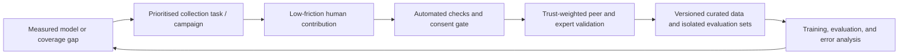
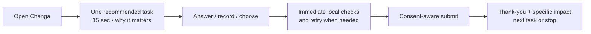

# Changa strategic implementation plan

## Executive recommendation

Changa should be a **task-driven, consented African-language data engine inside Samiati**.  It should initially feel like a fast way to help one’s language—translate a prompt, say a phrase, or judge which sentence sounds natural—not like a data-labeling site.  Its product is not the raw contribution; its product is a governed, traceable, purpose-specific dataset that improves Samiati and proves that it did.

The strongest long-term position is a combination of (1) a Samiati contribution feature, (2) a community language-preservation network, and (3) a high-quality data and evaluation platform.  It should **not** begin as a general-purpose open crowdsourcing marketplace.  That positioning would create the wrong incentives, expensive moderation, weak consent, and low-quality volume before Changa has a trusted community and a reliable curation operation.

The strategic loop is:

The immediate implementation priority is not more challenge or gamification UI.  The repository needs to connect the task/submission schema that already exists to the real user flows, durable media, reliable quality jobs, and a review queue.  Only then should Samiati invest in adaptive allocation, creator challenges, advanced reputation, or active learning.

## What the repository has today

### Existing foundation

- Next.js/React is the client application; Convex is the transactional backend and file storage; Clerk provides authentication.
- `convex/schema.ts` now contains a promising dedicated Changa model: task templates, tasks, campaigns, submissions, assets, validation assignments/votes, curated examples, releases, and user stats.
- `convex/changa/tasks.ts`, `submissions.ts`, `validation.ts`, `curation.ts`, `campaigns.ts`, and `stats.ts` expose an initial task → submission → validation → curation flow.
- `convex/asr.ts` can call Paza Whisper, while `convex/files.ts` can create authenticated upload URLs.  The application also has an audio recorder component and early task-specific UI components.
- The former generic `contributions`, challenges, and moderation views give useful social/community presentation primitives but should not become the training-data source of truth.

### Gaps and corrections required before launch

1. **Real data is not wired to the main UX.** `ChangaScreen.tsx`, `AddContributionScreen.tsx`, and `SubmitEntryScreen.tsx` presently maintain local/mock contribution state or simulate a submission.  `AccentRecorder`, `DialectMapper`, and `TotemUploader` are presentation prototypes.  A user can appear to have contributed without creating a durable Changa submission, uploading audio, or entering validation.
2. **There are two competing product models.** The generic `ContributionItem`/social-post workflow and the Changa domain model have incompatible types, statuses, and metadata.  Keep the legacy model for social posts; build adapters only for display.  Do not map a curated record back into an editable social contribution.
3. **Automated checks are insufficient and contain a data-flow error.** `runAutoChecks` compares `audioAsset.transcriptText`, but transcript text belongs to the submission, not the asset.  Its 200-item word-set similarity is only a placeholder; it has no language identification, PII/moderation integration, audio signal analysis, model provenance, or asynchronous job state.
4. **Validation is not yet quality-safe.** Two unweighted accepts automatically validate an item; any user may declare a moderator/expert role in their vote; a reviewer can see other votes; there are no gold tasks, language eligibility, vote diversity, reviewer conflict controls, escalation rules, or deterministic audit decisions.
5. **Current identifiers and metadata will not support dataset-grade provenance.** A `storageId` is stored as a string, language/dialect are unconstrained strings, consent has no policy version or withdrawal state, and curated examples only capture one scalar score.  There is no immutable event/audit log, source prompt version, model/check version, or release membership table.
6. **No export or evaluation boundary exists.** Dataset releases are records, not reproducible manifests.  There is no immutable holdout policy, deduplicated group split, export process, lineage to a model run, retirement propagation, or training-data deletion workflow.
7. **The platform is not yet mobile/offline resilient.** The browser recorder has neither resumable upload nor an offline draft queue, and the server ASR action requires a base64 upload.  It should not send large audio blobs through an action in production.

Treat the files above as uncommitted work in progress.  Preserve their intent, but make these corrections while the schema is still inexpensive to change.

## Product boundaries and operating principles

### Who Changa serves

| Participant | Main need | Changa value |
| --- | --- | --- |
| Everyday native or heritage speaker | Help quickly without linguistic expertise | Purpose, recognition, a voice for their language |
| Fluent contributor / teacher | Give accurate examples and protect local usage | Higher-value work, visible stewardship, fair recognition |
| Reviewer / moderator | Resolve correctness and cultural ambiguity | Clear evidence, limited authority, an accountable queue |
| Language expert / community institution | Steward a language and approve sensitive work | Control, attribution, paid/contract work where appropriate |
| Samiati ML/data team | Reliable, diverse, legal, reproducible data | Purpose-built datasets and feedback from model gaps |

### Non-negotiable rules

- Ask only for information that cannot be inferred safely.  Show the supplied source prompt, language, task goal, and consent context; request the answer, a narrow contextual disambiguator when needed, and optional demographic data only when the data program needs it.
- A raw submission is never training data.  It may be harmful, mistaken, withdrawn, duplicated, or inappropriate for the intended model.
- Preserve sensitive/offensive linguistic material with strict access and use labels where lawful and consented; do not silently place it in general assistant training.
- Quality is a vector, not a popularity count: linguistic correctness, naturalness, task compliance, safety/consent, audio fidelity, diversity, and provenance are separate dimensions.
- Do not collect precise location, age, gender, identity, or cultural knowledge by default.  Collect coarse, optional, purpose-specific data with an explicit explanation and a “prefer not to say” choice.
- The correct unit of product work is a **versioned task contract**, not a free-form form.  Each task contract defines its output, validation rubric, permitted use, reward, and destination data product.

## Data portfolio: collect deliberately

### Priority ranking for the first two years

| Tier | Data product | Value and rationale | Collector / validator | Initial decision |
| --- | --- | --- | --- | --- |
| P0 | Parallel phrase/sentence text with context | Direct MT and instruction-tuning value; contextual, natural translations are scarce | Fluent speakers; 2–3 independent native reviewers | Must have |
| P0 | Translation preference/naturalness pairs | High signal per interaction for ranking literal vs natural output | Everyday fluent speakers; disagreement adjudication | Must have |
| P0 | Read speech + verified transcript | Core ASR/TTS seed data, pronunciation and voice coverage | Consent-qualified speakers; automated audio checks + transcript review | Must have, narrow scripted start |
| P0 | Evaluation holdouts | Required to know whether data improves models; difficult to recreate later | Paid experts / verified experts; isolated governance | Must have from day one |
| P1 | Lexicon, named entities, terminology, pronunciation | Efficient vocabulary coverage and domain adaptation | Contributors; expert samples and consensus | Should have |
| P1 | Code-switching, slang, idioms, regional variants | A durable moat: common in lived speech and weak in global datasets | Community contributors; context-aware reviewers | Should have after base quality works |
| P1 | Short spontaneous speech prompts | Represents real ASR conditions better than reading alone | Repeat trusted speakers; transcript + privacy checks | Pilot, then expand |
| P1 | Cultural context and definitions | Valuable for retrieval/grounding; high harm and ownership risk | Experts/community stewards | Expert-gated only |
| P2 | Sentiment, emotion, toxicity and pragmatics labels | Useful but label definitions vary by language/community | Multiple trained labels and expert adjudication | Targeted campaigns only |
| P2 | Multi-turn conversations | Valuable for assistants but hard to consent, redact, and validate | Opt-in paired contributors / experts | Later, with a dedicated protocol |
| P3 | Images, totems, personal stories, broad location maps | Limited direct model value relative to privacy/IP burden | Experts/rights holders | Do not collect generically |
| P3 | Open-ended “submit anything” text/audio | High moderation and poisoning cost; weak coverage control | N/A | Do not build as default |

For Sheng, naturalness choices, contextual phrase translation, code-switching and informal read/spontaneous audio deserve early pilots; standard Kiswahili alone is not a moat.  For Kikuyu, Dholuo, Kalenjin, Luhya, Kamba, Gusii, Meru, Maasai and Somali, begin with a language steward and a small expert-reviewed seed set before opening broad collection.  These labels are families with substantial regional/dialect variation; never pretend one prompt represents an entire language.

### Data types, expected task and admission rule

| Data category | Lowest-friction task | Generated/inferred by Samiati | Human review required? | Dataset destination |
| --- | --- | --- | --- | --- |
| Word/phrase/sentence parallel text | “How would you actually say this?” | Source, language pair, prompt version, normalisation candidates | Yes, native agreement | MT / NLG candidate |
| Correction / preference | “Which sounds more natural?” or “Fix this” | Candidate outputs, model/version, difficulty | Usually consensus | Preference / evaluator data |
| Lexicon, definition, idiom, slang | Supply one term; optionally choose its sense/context | POS/sense suggestions, duplicate candidates | Yes for sense/culture | Lexicon / retrieval |
| Pronunciation/read speech | Hear/read one short prompt; hold to record | Duration, SNR, clipping, ASR hypothesis | Transcript/audio agreement | ASR/TTS candidate |
| Spontaneous speech | Answer a privacy-safe 10–20 second prompt | VAD, language ID, ASR, PII flags | Yes, transcript and consent | ASR robustness only |
| Transcription | “What was said?” | Audio segment, ASR draft, timestamps | Two independent transcribers | ASR candidate |
| Dialect / variant | Select broad dialect/region only if known | Language hypothesis and broad region options | Expert on disputed labels | Coverage metadata |
| Code-switching | Label spans or select dominant language | Token-level LID candidates | Multiple labels for ambiguity | LID / conversational evaluation |
| Sentiment/pragmatics | Choose one narrow label with context | Model suggestions and sensitive-content flag | Multi-label/expert sampling | Classifier/evaluation |
| Cultural knowledge | Explain an approved, non-sacred prompt | PII and duplication checks | Language steward / rights holder | Restricted retrieval/evaluation |

### What deliberately stays out of the first scope

- Full conversational recording, children’s voices, exact GPS collection, biometric voice profiling, political opinion campaigns, scraped WhatsApp/private messages, and “record people around you” prompts.
- A generic image/totem collection flow.  It confuses cultural sharing with training-data collection and creates copyright and sacred-knowledge issues.
- Synthetic text as a substitute for human linguistic evidence.  Synthetic candidates may seed a **validation** task, but accepted human validation must retain the model/prompt provenance and never be counted as independently collected text.
- Unbounded manual metadata forms, arbitrary custom contribution types, and public leaderboards ranked on raw volume.

## The experience to build

### Task modes

1. **Quick (5–20 seconds):** one prompt, one action, immediate acknowledgement.  Examples: write the Sheng expression for “I am broke”; choose which Dholuo translation sounds natural; say a supplied Kikuyu sentence; mark a transcription correct/incorrect.
2. **Focused (1–5 minutes):** a short bundle, not a large form.  Examples: supply three alternatives for an idiom, transcribe three short clips, translate a mini-dialogue, or review five closely related responses.
3. **Steward/expert:** an explicitly different workspace for benchmark authoring, adjudication, glossary management, cultural material, and sensitive queue review.  It should have rubrics, audit context and compensated-work support where applicable—not gamified rapid-fire controls.

### Default mobile flow

The home screen should show one primary “Help [language] for 15 seconds” action, an optional task switcher, short language-health goal, and personal impact.  It must not open on a language/type picker and a blank contribution form.  The supplied prompt means a user should almost never type the English/source text, category, language code, quality metadata, or duplicate information.

For every task, show: what to do, why it helps, time estimate, language/dialect scope, a clear skip, privacy/consent summary, and a post-submit state of “received / needs a quick retry / being checked / accepted” rather than falsely claiming a model learned it immediately.

### Audio protocol

- Start with 2–8 second read prompts, 16 kHz+ mono preferred (keep original), one phrase per clip, a 2-second maximum silence guideline, and a clear playback/re-record step.  Do not cap every clip at 25 seconds as the legacy screen does; task contracts should define min/max duration.
- Separate **clean read speech** (TTS/ASR alignment), **natural read variants** (accent/pace), and **spontaneous speech** (ASR robustness).  Background noise, fillers, accents, code-switching and hesitations are useful labels for representative ASR; clipping, silence, impersonation, manipulated/replayed audio, and unconsented third-party speech are rejection/limited-use conditions.
- Capture speaker coverage only through optional coarse bands (self-described fluency, broad region/dialect, age band where justified) and track it as coverage, not as a target for identity inference.  Avoid gender as a default proxy for voice diversity.
- Do basic VAD, duration, clipping, peak/RMS and MIME/file-size checks locally before upload.  Do full decoding, SNR, ASR, language ID, duplicate/fingerprint checks, PII/safety screening and malware scanning server-side/asynchronously.  The server remains authoritative.
- Upload to storage via resumable, checksum-verified chunks; store an immutable asset record and then enqueue processing.  Convert/derive a standard training format in a controlled pipeline, while preserving original bytes and transform provenance.

### African mobile reality

- Make all contribution surfaces responsive first, support recent low-end Android browsers, use a light JS bundle and static task payloads, avoid mandatory maps/video, and use large targets/voice instructions.
- Put unsent text and encrypted local audio-draft metadata in IndexedDB; show storage/data estimate and an explicit “upload on Wi‑Fi” choice.  Audio must remain a local draft until consent and upload succeed.
- Implement a service-worker-backed retry queue with idempotency keys, exponential backoff, resumable uploads, checksum verification, and explicit conflict handling.  Do not claim “offline complete” until uploads and server checks finish.
- Measure completion/drop-off, microphone-permission failure, upload failure, retry rate, device memory class, and median bytes/task by task type.  These must govern UX decisions.

## Dataset-grade architecture

### Canonical domain model

Retain the current namespace, but evolve it to the following contracts.  Use typed Convex IDs rather than `LooseDb`/string IDs as soon as the schema migration stabilizes.

| Entity | Purpose and essential additions |
| --- | --- |
| `languageVariants` | Canonical BCP-47/Glottolog-style language, dialect, orthography, region hierarchy, steward, status, label policy.  Never make UI names the identifiers. |
| `changaTaskTemplates` | Immutable template version: task type, prompt/input/output schema, rubric version, destination data product, risk tier, required consent, quality gates, reward policy. |
| `changaTasks` | A generated instance: template version, prompt/content asset, priority reason, target coverage cell, availability/expiry, quota, experiment/campaign and active-learning request ID. |
| `changaTaskClaims` | Short leases and skip reason.  Prevent duplicated work without permanently blocking a user. |
| `changaSubmissions` | Append-only raw answer/provenance.  Include client idempotency key, task/template/prompt version, language selection confidence, consent snapshot/version, status and withdrawal state.  Edits create revision records. |
| `changaSubmissionAssets` | Typed storage ID, original/derived asset relationships, checksums, codec/sample rate/duration, upload/processing status, retention class—not ASR result alone. |
| `changaProcessingRuns` | One record per LID, ASR, audio QC, moderation, dedupe and normalisation run with model/version/config/input/output/decision. |
| `changaValidationAssignments` and `Votes` | Blind independent votes, eligibility snapshot, rubric version, confidence, structured issue codes, disclosed conflicts and timestamp. |
| `changaDecisions` | Immutable consensus/adjudication outcome with reason, resolver, evidence version, and appeal state.  Do not infer final state only from current vote counts. |
| `changaCuratedExamples` | Normalized, purpose-specific representation plus multidimensional quality vector, use restrictions, provenance references, dedupe cluster and lifecycle state. |
| `changaDatasetReleases` + `ReleaseMembers` | Immutable manifest/criteria/code versions/checksums, membership records and split.  A release may reference an example, not mutate it. |
| `changaEvaluationSets` + `Items` | Physically/logically isolated holdouts, access role, author/reviewer identities separated from collectors, contamination fingerprints, and never a general curation status. |
| `changaReputationEvents` / `RoleGrants` | Explainable earned trust and language-scoped role eligibility; never derive authority from a user-provided role string. |
| `changaConsentPolicies`, `ConsentRecords`, `DeletionRequests` | Versioned consent, revocation, scope, attribution preference, jurisdiction/guardian protocol if ever needed, and erasure/retirement workflow. |
| `changaCampaigns` / `ChallengeProposals` | Structured collection initiative, data objective, risk tier, approvals, budget, stop rule and final outcome—not a social post. |

Keep `contributions`, `challenges`, and `challengeEntries` as legacy/social tables while migrating screens.  Do not try to add all fields to them.

### State transitions

`draft_local → uploading → submitted → processing → eligible_for_review → in_review → accepted | needs_fix | rejected | restricted → curated_candidate → released | retired`

Withdrawal is an orthogonal state/action.  It immediately removes an item from future task allocation and exports, then propagates retirement into affected future releases/model retraining policy.  Never overwrite a submission, reviewer vote, quality run, consent snapshot, or release manifest; append revision/events.

### Quality and moderation pipeline

1. Validate task contract, auth, throttle, idempotency, consent and required output on submission.
2. Store raw data and original asset separately from user-visible derived data; quarantine unsafe/unscanned files.
3. Enqueue processing: malware/type validation, audio decode/QC, text normalisation candidates, LID, PII detection/redaction candidate, content classification, exact and semantic/text/audio duplicate clustering, ASR and task-specific consistency checks.
4. Produce a **quality vector**, e.g. `task_compliance`, `language_confidence`, `linguistic_naturalness`, `agreement`, `audio_signal`, `safety_risk`, `duplicate_risk`, `provenance_completeness`, and `coverage_novelty`; include model/check versions and explanations.
5. Route deterministically by risk and confidence: automatic low-risk acceptance only after calibrated evidence and sampled audits; peer consensus for normal work; language moderator for disagreement/rare variants; expert or community steward for cultural/sensitive/high-impact data.
6. Create an immutable decision, then normalize only the allowed fields into a curated candidate.  Curation sets intended use and split eligibility; a release job alone adds it to a dataset manifest.
7. Continuously sample accepted/rejected items for audits, calibrate automatic thresholds by language/task, and support appeals/corrections.

Use moderation labels to partition access and training eligibility.  Profanity, insults and political/sensitive content can be useful for language ID, safety evaluation or a restricted moderation model, but must never silently flow into general translation, assistant, or public datasets.  Automation narrows work; it cannot decide subtle naturalness, dialect legitimacy, cultural context, consent ambiguity, or novel abuse without accountable human review.

### Validation, reputation and moderation

- Review one item at a time, blind to other votes and contributor identity until a decision where possible.  Ask task-specific binary/choice questions rather than one generic “approve”: correct language, intended meaning, naturalness, audio clarity, dialect plausibility, safety/use eligibility.
- Require 2–3 independent eligible reviewers from distinct trust/relationship buckets for standard data.  Flag both unusually fast agreement and coordinated disagreement.  No user reviews their own work, household/device cluster, or a task they authored; rate limit repeated pairs.
- Seed validation queues with hidden, versioned expert gold items.  Compute reviewer accuracy against gold and later adjudications; use Bayesian/shrinkage estimates, recency and sample size rather than a raw “accept percentage.”
- Progression is language-scoped: New Contributor → Contributor → Trusted Contributor → Community Reviewer → Language Moderator → Verified Expert.  Role grants require minimum accepted work, calibrated review performance, conduct history, relevant language attestation and human approval for moderator/expert roles.
- Reviewers may route, request a minor correction, accept, reject with reason, or escalate.  Only explicitly assigned language moderators resolve standard disputes; experts/stewards resolve defined cultural, legal, or benchmark issues.  All reversals require a reason and are audit sampled.
- Reward accepted useful contributions, careful corrections, reviewer agreement and difficult/undercovered coverage—not quantity.  Show a tier and clear earned capabilities; do not expose a manipulable universal “trust score.”

### Anti-abuse and poisoning controls

Apply progressive friction, not blanket friction: device/account velocity limits, verified account thresholds for higher-risk queues, task claims, CAPTCHA only under suspicion, submission idempotency, IP/device privacy-preserving risk signals, duplicate/semantic/audio fingerprint clusters, anomaly detection by cohort/task, and independent review diversity.  Quarantine coordinated patterns and keep export rollback possible through release membership and immutable lineage.  Store AI-generation likelihood as a weak routing signal, never proof; human contributors may legitimately use assistive tools where task policy permits.

## Governance, consent and ownership

Before collecting the first training record, create a data governance decision record with product, ML, security, and community representation.  Obtain qualified Kenyan/international privacy and IP advice for actual launch jurisdictions and community agreements; this plan is not legal advice.

- Use a short just-in-time consent plus a readable full policy.  Separate: collection/storage, training, research, commercial use, public release/attribution, and voice use.  Default attribution to private/pseudonymous.
- Consent must name the policy version, task/data type, permitted uses, licence, retention/withdrawal process and whether a reward has been earned.  A checkbox hidden in a generic terms page is insufficient for voice or cultural knowledge.
- Set one default licence only after product/legal/community decision.  A reasonable product direction is Samiati rights to process and use accepted contributions for the disclosed services/model development, with optional public-release tracks that require a separate compatible licence.  Do not promise a “community” licence that has no enforceable terms.
- Certain cultural knowledge needs a steward-approved, community-controlled or no-training tier.  Mark it restricted; do not treat individual uploader consent as permission to commercialize collective/sacred knowledge.
- Build data subject requests: export, correction, withdrawal/deletion, grievance and moderation appeal.  Define the irreversibility boundary for already trained models truthfully; future releases/retraining must honor removals.
- Never use precise location, contacts, background recordings, minors, health/biometric inference, or third-party speech without a dedicated approved protocol.

## Dataset, evaluation and model operations

### Release and split policy

Create separate raw, validated, curated, train, dev, test, and production-feedback stores/access roles.  Evaluation items are authored or selected under a different workflow, held in a separate table/bucket, and cannot appear in the normal task/review feed.

Assign train/dev/test at a dedupe-cluster and, where appropriate, speaker/community/prompt-family level **before** release.  Prevent a speaker, paraphrase, source sentence, challenge bundle, or near duplicate from straddling evaluation and training.  Run semantic, lexical and audio fingerprint contamination checks at every export and record the report in the manifest.  Human experts should author small, high-quality dialect, code-switching, safety and cultural evaluation slices early, even if training volume remains small.

### Reproducible training handoff

The export service should create signed/immutable manifests (JSONL/Parquet pointers, content hashes, licences/consent eligibility, quality criteria, selection query, code/container version, source release IDs and statistics).  It sends a training package to the ML environment—not a production Convex query.  The ML registry then records dataset manifest, tokenizer/normalizer, model base, hyperparameters, evaluation set version, metrics and error analysis.  On a later invalidation, query lineage from submission → curated example → release members → model runs, retire future packages and create retraining/evaluation work items.

Add a data-reliability dashboard per language/variant: accepted count, reviewer agreement, pass/fail reason, source diversity, speaker coverage (aggregated), duplicate rate, unresolved queue age, consent eligibility, release coverage and model metric movement.  Do not represent count as “language health” without a task-specific target and quality measure.

### Active learning, safely deferred

After the MVP delivers trusted releases and stable evaluation:

1. Capture model errors/low-confidence cases without automatically exposing user/private production text.
2. Aggregate them into approved collection needs: missing terminology, confusion pairs, underperforming dialect slice, ASR word error clusters, or model disagreement.
3. A data steward approves a task template, prompts and privacy risk; the allocator balances model utility with diversity and contributor fatigue.
4. Measure model/evaluation improvement against a fixed holdout, not the data used to choose the task.
5. Feed observed quality/cost/coverage back into the allocator.

This is Changa’s durable advantage, but launching it before baseline benchmarks and governance would optimize for model noise and accidentally create contaminated test data.

## Structured challenges and community flywheel

Rename social “challenges” to **campaigns** in the data workflow.  A campaign must include target language/variant, data product, prompt/template versions, example, collection/validation quota, quality rubric, permitted use, risk tier, budget/rewards, owners/moderators, start/stop criteria, and success metric.  Promote only campaigns that fill a measured coverage/quality gap; merge duplicates; pause campaigns with rejection/abuse rates above threshold; close campaigns once their intended coverage is reached.

In Phase 3, allow trusted contributors to submit campaign proposals—not create live collection work.  A language moderator/data steward approves, adapts or rejects it.  This preserves local initiative while preventing the platform from becoming an unmoderated content feed.  Recognize proposers where their campaign achieves accepted diverse data, not for gross submissions.

The flywheel is defensible only if contributors can see credible impact (“18 of your accepted phrases entered Kiswahili–Sheng Dataset 0.3”; “this campaign closed an accent-coverage gap”) and communities have meaningful stewardship.  More contributors alone increase cost and poisoning risk; quality/reputation, governance and task allocation make the flywheel positive.

## Delivery plan

### Phase 0 — Decide the data program (2–4 weeks)

**Outcome:** an approved, narrow pilot: two language/variant programs, 3–4 task contracts, a data owner, a language steward for each program, policy/consent wording, rubrics, and a tiny expert-authored holdout.

- Establish data product owners and a language advisory/steward roster for the pilot languages (recommended: Kiswahili–Sheng contextual text and one of Kikuyu/Dholuo read-speech pilots, only with committed reviewers).
- Define task contracts and rubrics for phrase translation, naturalness preference, audio reading, and transcription.  Set acceptance, escalation, withdrawal and compensation policies.
- Produce a threat model and DPIA-style privacy/security review, select storage retention/region, decide public vs restricted release policy, and create no-go criteria for sensitive/cultural work.
- Establish baseline model/coverage metrics and expert holdouts before broad collection.  Make the target concrete: e.g., 500–1,000 accepted, diverse phrase pairs—not “1 million submissions.”

**Exit:** written program card per task and tests/fixtures for every allowed and disallowed state transition.

### Phase 1 — Make task-driven MVP real (4–6 weeks)

**Outcome:** an authenticated user can complete a single text or audio task, see an honest submission state, and the backend produces a traceable raw record.

1. **Schema migration.** Modify `convex/schema.ts` and `convex/changa/validators.ts` to add template versions, task claims, submission revision/idempotency fields, processing status/runs, typed storage IDs, consent policy version, and decision records.  Correct indexes to match actual query prefixes; add an explicit status/language queue index rather than querying an incompatible composite index.
2. **Authoritative APIs.** Replace `LooseDb` with typed document APIs after the migration.  Add `claimRecommendedTask`, `skipTask`, `createSubmissionDraft`, `completeUpload`, `submitSubmission`, `getMySubmissionStatus`, and internal `enqueueProcessing`.  Enforce task schema and server-derived language/task fields; remove `createSimpleSubmission`’s implicit task creation and default training consent.
3. **Real submission wizard.** Replace `src/components/screens/ChangaScreen.tsx`’s custom blank word/recording loop and `AddContributionScreen.tsx`’s generic form with `ChangaHome`, `TaskRunner`, `TaskAnswer`, `SubmitResult`, and `MyActivity` components driven by task contract.  Migrate dashboard routes to use Convex hooks.  Keep the old social contribution route behind a legacy label until it is retired.
4. **Media ingestion.** Upgrade `src/components/media/AudioRecorder.tsx` (or replace it) with MIME support detection, record/play/re-record, local metrics, duration task limits, file checksum and upload progress.  Use `convex/files.ts` only to issue authenticated upload URLs; persist the storage asset with a complete-upload mutation.  Do not send audio base64 through `convex/asr.ts` from the UI.
5. **Instrumentation.** Add anonymous task lifecycle events: offered, claimed, started, permission denied, draft saved, upload started/failed/resumed, submitted, needs retry, and completed.  Attach task/template/client app version, never raw response text.

**Acceptance:** no screen reports success unless the server has stored the task-bound submission; duplicate submit/retry is idempotent; a user can withdraw a draft; an uploaded asset is access-controlled; a 15-second text task has median completion under 30 seconds in usability testing.

### Phase 2 — Processing and minimum defensible quality (4–8 weeks)

**Outcome:** raw submissions cannot enter curation without automated evidence and a routing decision.

- Add an internal job/queue worker (Convex scheduled/internal actions initially; external media/data workers when duration requires) for text normalisation candidates, LID, exact/near dedupe, PII/content screening, audio decode/VAD/SNR/clipping, ASR and transcript comparison.  Store model/version/config results in `changaProcessingRuns`.
- Repair and replace `runAutoChecks`: compare submission transcript to asset ASR; use language-aware normalisation and per-task thresholds; return “unknown/route to human” rather than false certainty.  Store audio quality components separately from a broad quality score.
- Build a transparent submission result: “accepted for review,” “please re-record—too quiet,” “we need a small correction,” or “cannot accept because of policy,” with an appeal/retry path.  Do not reveal enough detector detail to teach abuse.
- Create a restricted moderation lane for PII, sexual content, threats, hate/sensitive political content, and cultural/religious material.  Redaction/segmentation is a review action, not an automatic license to train.
- Add account/device velocity limits and operational alerts for spike, duplicate, failure and queue-age anomalies.

**Acceptance:** every curated candidate links to a successful required processing run; potentially unsafe items never enter ordinary peer review; audio quality rejection reasons are measured; all decisions are explainable by stored evidence.

### Phase 3 — Peer review, expert governance and fair reputation (6–10 weeks)

**Outcome:** decisions have calibrated, language-appropriate evidence rather than a two-click count.

- Build `ValidationQueue` and `ValidationTaskRunner`, not a generic social moderation card.  Use blind, task-specific controls and a clear “not sure/escalate” path; preload assets securely and do not expose contributor identity/precise metadata.
- Implement assignment matching by language variant, eligibility role, conflict/rate rules and queue urgency.  Add votes, outcomes, adjudications, issue taxonomy, reviewer instructions and immutable audit logs.
- Build gold-task authoring and a reviewer calibration service.  Create language-scoped role grants and reputation events; migrate existing user `level`/XP only as cosmetic legacy data, not as review authority.
- Give moderators a queue, evidence, audit samples, appeals and workload limits.  Experts can author gold/evaluation data and resolve defined escalations; they do not need to manually approve all work.
- Add accuracy-weighted rewards, contributor feedback after final decision, and impact views based only on finalized/eligible examples.

**Acceptance:** reviewers cannot self-review or impersonate roles; final decision rules are versioned and auditable; low agreement routes to escalation; gold accuracy/rater agreement and moderator overturn rate are visible per language/task.

### Phase 4 — Curation, releases and evaluation operations (4–8 weeks)

**Outcome:** an ML engineer receives a reproducible, purpose-specific package and evaluators remain uncontaminated.

- Extend `convex/changa/curation.ts` with curation review, required quality vector/use restrictions, dedupe-group split assignment and multi-item release membership.  Prevent a second curation promotion of the same revision without an explicit replacement relationship.
- Build a restricted dataset/export service outside the user-facing app that writes immutable manifests and data packages.  Record source query, policy/filter/code versions, statistics, content hashes, consent/license eligibility and release notes.
- Establish `EvaluationSet` flows: expert authoring, independent review, access controls, frozen versions, contamination detection and explicit no-training guardrails.
- Integrate the ML experiment registry and add model-to-release lineage.  Add release retirement/deletion propagation and rollback exercises.

**Acceptance:** two exports with the same manifest reproduce the same members/hashes; a test item cannot be selected for a training release; an invalidated submission can be traced through releases/model runs in a rehearsal.

### Phase 5 — Campaigns, adaptive allocation and coverage (6–12 weeks)

**Outcome:** community activity is directed toward valuable coverage gaps without sacrificing governance.

- Replace broad public challenge creation with campaign proposal/review/publishing.  Rework `convex/changa/campaigns.ts`, `ChallengeDetailsScreen.tsx`, `AddChallengeScreen.tsx`, and `SubmitEntryScreen.tsx` to work only with approved task contracts and real completion counts.
- Build coverage cells by language/variant, data product, domain, dialect/region (when consented), speaker cohort (aggregate only), prompt family and quality.  Allocate tasks through simple transparent rules first: language eligibility + open quota + scarcity multiplier + fatigue cap.
- Add weekly language stewardship reports and language health goals tied to a defined target/quality metric.  Add streaks/badges only after acceptance status, clear user-facing data impact, and abuse-safe reward accounting work.
- Pilot contributor/creator recognition and carefully scoped paid expert/moderator work.  Measure whether rewards improve accepted diverse data rather than merely submissions.

**Acceptance:** every promoted campaign maps to a stated dataset/coverage goal; allocation improves coverage/quality relative to random task feed; campaigns automatically pause on defined quality/abuse stop rules.

### Phase 6 — Active learning and data network (ongoing, after stable releases)

**Outcome:** measured model shortcomings create approved, privacy-safe Changa tasks.

- Ingest aggregate evaluation/error-analysis requests into a task-backlog service, with steward approval and training/test isolation.
- Rank candidate tasks by expected information gain, coverage novelty, cost, reviewer capacity and contributor fatigue; use randomized holdbacks to validate that allocation is genuinely better.
- Add organization/community partnerships, steward agreements, restricted community-controlled datasets and optional external data licensing only after provenance/release governance has proven reliable.
- Consider a standalone African-language data platform only when Changa can publish verifiable dataset cards, contractual community control, trusted reviewer supply and repeatable release quality.  It is not a Phase 1 business model.

## File-level implementation map

| Area | Existing files to change | New modules/components |
| --- | --- | --- |
| Domain/schema | `convex/schema.ts`, `convex/changa/validators.ts`, `convex/changa/db.ts` | `convex/changa/consent.ts`, `decisions.ts`, `processing.ts`, `reputation.ts`, `evaluation.ts`, `releaseMembers.ts` |
| Task allocation | `convex/changa/tasks.ts`, `stats.ts`, `campaigns.ts` | `allocator.ts`, internal recommendation/claim jobs |
| Submission/media | `convex/changa/submissions.ts`, `convex/files.ts`, `convex/asr.ts` | upload completion, checksum/asset processor, local draft queue |
| Quality/safety | `convex/changa/validation.ts`, `curation.ts`, `convex/moderation.ts` | processing-run worker, LID/dedupe/audio QC adapters, policy router |
| User flows | `src/components/screens/ChangaScreen.tsx`, `AddContributionScreen.tsx`, `SubmitEntryScreen.tsx`, `AudioRecorder.tsx` | `src/components/changa/ChangaHome.tsx`, `TaskRunner.tsx`, `TaskResult.tsx`, `MyChangaActivity.tsx`, `ValidationRunner.tsx`, `OfflineDraftQueue.tsx` |
| Routes/navigation | dashboard Changa/contribution/challenge/validation pages and `src/types.ts` | typed route/task IDs and legacy adapters |
| Data operations | `convex/changa/curation.ts`, `convex/crons.ts` | protected export service, dataset manifest tooling, evaluation administration UI |
| Observability/test | existing app telemetry/error handling | task funnel dashboard, queue/quality dashboards, fixtures, integration/e2e/load tests |

## Prioritisation matrix

| Initiative | Impact | Cost/difficulty | Strategic data value | Priority |
| --- | --- | --- | --- | --- |
| Task contract + real submission/storage/consent | Very high | Medium | Very high | Must have |
| Narrow text/audio quick-task UX | Very high | Medium | Very high | Must have |
| Processing evidence, safety routing, dedupe | Very high | High | Very high | Must have |
| Blind peer review + expert escalation | Very high | High | Very high | Must have |
| Immutable curation/release/evaluation separation | Very high | High | Very high | Must have |
| Offline drafts/resumable uploads | High | Medium/high | High | Must have for audio/mobile launch |
| Language steward program and calibration | Very high | Medium operational | Very high | Must have |
| Campaign proposal/review | High | Medium | High | Should have |
| Coverage-based allocation | High | Medium | High | Should have |
| Code-switching/idiom/spontaneous-speech pilots | High | High | High moat | Should have after quality baseline |
| Contributor impact/rewards | Medium/high | Medium | Medium | Should have after real acceptance |
| Paid expert marketplace | Medium | High operational/legal | High for hard data | Later |
| Active learning allocator | Very high eventual | High | Very high | Later; depends on benchmarks |
| Broad sentiment/emotion labels | Medium | High ambiguity | Medium | Later/targeted |
| Generic public challenge creation | Low/negative before governance | Medium | Unpredictable | Do not build now |
| Broad cultural images/totems/freeform uploads | Low/negative | High privacy/IP | Low | Do not build generically |

## Success gates, economics and risks

Launch each task type only when it meets a quality and economic gate: completion rate, accepted-per-started rate, review agreement, queue age, cost per curated example, coverage novelty, privacy/safety incident rate, and held-out model/evaluator benefit.  Track storage/upload/ASR/moderation separately: text is cheap to store but can be costly to adjudicate; audio is materially more expensive in upload, storage, transcription, processing and privacy review; expert benchmarks are low-volume/high-cost but non-negotiable for learning whether any spend helps.

Use **cost per accepted, diverse, release-eligible example** and **measured performance/coverage gain per dollar** as primary economic metrics—not cost per raw contribution.  Cap campaign budgets and review queues.  If a task’s acceptance rate, agreement or information gain stays low, redesign or stop it rather than adding gamification.

The most important risks are false consent, test contamination, data poisoning, language/dialect erasure through over-normalisation, capture of sacred/community knowledge, demographic bias, reviewer burnout, inflated gamification metrics, and assuming generic LID/ASR/moderation works equally well for under-resourced languages.  Every phase above has a gate specifically intended to surface one of these before scale.

## First implementation sprint

1. Freeze the MVP scope to text phrase translation + naturalness validation and one carefully consented read-speech task for two pilot language programs.
2. Run a schema/API design review; add task/template/consent versioning, upload completion, idempotency, processing state and authoritative indexes before migrating UI.
3. Build the server-backed `TaskRunner` and replace local/mock success paths in `ChangaScreen.tsx` and `SubmitEntryScreen.tsx`.
4. Connect `AudioRecorder` to authenticated storage and server-side asset creation; implement only basic duration/silence/MIME checks in the first slice.
5. Create a minimal internal processing job and validation queue with a written rubric plus two language stewards.  Do not auto-curate yet.
6. Instrument the funnel and run 10–20 moderated usability sessions on low-end Android/network conditions.  Revise the task contracts before public launch.

That sequence produces the lowest-friction system that is still capable of earning trustworthy data.  It avoids the common failure mode of building a richly gamified contribution surface that produces a large, legally unclear and scientifically unusable pile of submissions.
