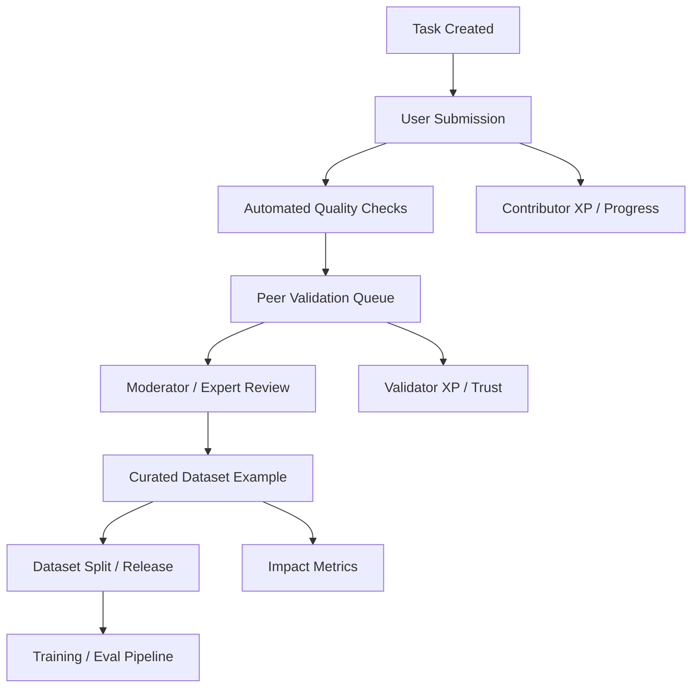

# Changa v2 Implementation Plan

## Overview

This document defines the next implementation phase for Changa inside Samiati.

The core change is architectural:

- Move Changa from a generic community-post model to a task-driven language data system
- Separate raw submissions from validated training examples
- Make audio, text, and validation flows first-class
- Design for low-literacy, mobile-first contribution
- Build a direct path from user contribution to curated AI training data

---

## Current State Summary

### Strengths already in the repo

- Convex backend and schema foundation already exist
- Contribution UI, moderation UI, challenge UI, XP logic, ASR, and translation helpers already exist
- Challenge-specific UI components already exist for accent, dialect, and totem tasks

### Structural gaps

1. **Contribution flow is still prototype-grade**
   - The main add-contribution flow currently saves through mock/local state instead of a real production submission pipeline
   - Changa data is treated like a social content object, not a training data object

2. **Schema is UI-oriented, not dataset-oriented**
   - The current `contributions` table mixes moderation state, presentation fields, and content fields
   - There is no separation between:
     - raw user submission
     - validation evidence
     - approved dataset example
     - dataset release/version

3. **Validation is too centralized**
   - Current moderation is primarily moderator approval/rejection
   - There is no trust-weighted peer validation, gold-task evaluation, or consensus workflow

4. **Media pipeline is incomplete**
   - Upload URL generation exists, but contribution media is not modeled as durable training assets
   - Audio transcription exists, but there is no structured ASR verification workflow

5. **Taxonomy drift exists across the app**
   - Contribution types differ across schema, UI, and XP logic
   - This will cause reporting, filtering, and dataset export problems at scale

---

## Product Goals

Changa v2 should optimize for five outcomes:

1. **High participation**
   - Fast, low-friction, mobile-first task completion

2. **High retention**
   - Recurring missions, visible impact, meaningful progression

3. **High quality**
   - Structured tasks, automated checks, peer review, expert review

4. **Model usefulness**
   - Every accepted record should map cleanly into training/evaluation datasets

5. **Operational scalability**
   - Clear queueing, validation, curation, and release pipelines

---

## Design Principles

1. **Task-first, not post-first**
   - Users should usually complete a defined task, not submit arbitrary free-form content

2. **Raw and curated data must be separate**
   - Never train directly from raw submissions

3. **Validation is part of contribution**
   - Validators are contributors and should be rewarded as such

4. **Accessibility is not optional**
   - Voice guidance, simple steps, large actions, and local-language prompting should be built into the flow

5. **Trust should be earned**
   - Contributor and validator trust levels should gate privileges and auto-approval rules

---

## Recommended Changa v2 Architecture

### Recommended domain layers

1. **Task layer**
   - What should be collected
   - For which language, dialect, domain, and format

2. **Submission layer**
   - What the user submitted
   - Including media, metadata, and provenance

3. **Validation layer**
   - What reviewers decided
   - Including vote type, confidence, issue codes, and reviewer trust

4. **Curation layer**
   - What was approved for datasets
   - Including normalized fields and quality scores

5. **Release layer**
   - Which examples belong to which train/dev/test release

---

## Revised Convex Schema

Do not keep extending the current generic `contributions` table for Changa v2.

Keep it for legacy/social views if needed, but introduce a dedicated Changa namespace in `convex/schema.ts`.

### 1. `changaTaskTemplates`

Defines reusable collection templates.

Suggested fields:

- `name`
- `taskType`
- `instructions`
- `sourceMode` (`prompted`, `freeform`, `challenge`)
- `inputSchema`
- `outputSchema`
- `requiresAudio`
- `requiresTranslation`
- `requiresValidationCount`
- `isActive`
- `createdBy`
- `createdAt`

Example task types:

- `lexicon_entry`
- `phrase_translation`
- `sentence_translation`
- `audio_reading`
- `transcription`
- `cultural_context`
- `dialect_mapping`
- `validation`

### 2. `changaTasks`

Concrete work items generated from templates, campaigns, or backlog needs.

Suggested fields:

- `templateId`
- `languageCode`
- `dialectCode`
- `regionCode`
- `domain`
- `difficulty`
- `promptSourceText`
- `promptTargetText`
- `promptAudioAssetId`
- `challengeId`
- `priority`
- `rewardProfile`
- `status` (`open`, `paused`, `full`, `closed`)
- `targetSubmissionCount`
- `targetValidationCount`
- `createdAt`
- `expiresAt`

### 3. `changaSubmissions`

Raw user submissions.

Suggested fields:

- `taskId`
- `userId`
- `submissionType`
- `languageCode`
- `dialectCode`
- `regionCode`
- `sourceText`
- `targetText`
- `transcriptText`
- `contextNote`
- `gloss`
- `partOfSpeech`
- `speakerProfile`
- `consent`
- `license`
- `qualityFlags`
- `autoChecks`
- `status` (`draft`, `submitted`, `needs_fix`, `in_validation`, `validated`, `rejected`, `curated`)
- `submittedAt`
- `updatedAt`

### 4. `changaSubmissionAssets`

Stores media references and technical metadata.

Suggested fields:

- `submissionId`
- `storageId`
- `assetType` (`audio`, `image`)
- `mimeType`
- `durationMs`
- `sampleRate`
- `channels`
- `sizeBytes`
- `waveformPreview`
- `asrText`
- `asrConfidence`
- `snrScore`
- `clippingScore`
- `createdAt`

### 5. `changaValidationAssignments`

Optional queue table for assigning tasks to validators/moderators.

Suggested fields:

- `submissionId`
- `assignedTo`
- `roleRequired` (`peer`, `moderator`, `expert`)
- `status`
- `assignedAt`
- `completedAt`

### 6. `changaValidationVotes`

Structured review records.

Suggested fields:

- `submissionId`
- `validatorId`
- `validatorRole`
- `vote`
- `confidence`
- `issueCodes`
- `comment`
- `trustSnapshot`
- `createdAt`

`vote` should be constrained to values like:

- `accept`
- `minor_fix`
- `reject`
- `duplicate`
- `unsafe`
- `unclear_audio`
- `wrong_language`

### 7. `changaCuratedExamples`

Normalized training/eval-ready examples.

Suggested fields:

- `sourceSubmissionId`
- `exampleType`
- `languageCode`
- `dialectCode`
- `regionCode`
- `sourceText`
- `targetText`
- `transcriptText`
- `contextText`
- `audioAssetId`
- `qualityScore`
- `reviewSummary`
- `splitRecommendation`
- `releaseStatus` (`candidate`, `approved`, `exported`, `retired`)
- `createdAt`

### 8. `changaDatasetReleases`

Tracks exported dataset versions.

Suggested fields:

- `name`
- `version`
- `languageScope`
- `criteria`
- `exampleCount`
- `releaseNotes`
- `createdAt`
- `createdBy`

### 9. `changaUserStats`

Dedicated contribution and trust stats.

Suggested fields:

- `userId`
- `contributionCount`
- `validationCount`
- `acceptRate`
- `reviewAgreementRate`
- `trustScore`
- `streakDays`
- `lastActiveDate`
- `topLanguages`
- `badges`

### 10. `changaCampaigns`

Recurring missions and seasonal drives.

Suggested fields:

- `title`
- `description`
- `languageCode`
- `taskTypes`
- `goalCount`
- `currentCount`
- `rewardProfile`
- `startAt`
- `endAt`
- `status`

---

## Recommended Indexes

Add indexes around the actual operational queues.

Examples:

- `changaTasks.by_language_status`
- `changaTasks.by_campaign_status`
- `changaSubmissions.by_user_status`
- `changaSubmissions.by_task_status`
- `changaSubmissions.by_language_status`
- `changaValidationVotes.by_submission`
- `changaValidationVotes.by_validator`
- `changaCuratedExamples.by_language_releaseStatus`
- `changaCuratedExamples.by_releaseStatus_qualityScore`
- `changaUserStats.by_trustScore`

---

## API Design

Create a dedicated folder:

- `convex/changa/tasks.ts`
- `convex/changa/submissions.ts`
- `convex/changa/validation.ts`
- `convex/changa/curation.ts`
- `convex/changa/stats.ts`
- `convex/changa/campaigns.ts`

### Task APIs

Queries:

- `listAvailableTasks`
- `getTask`
- `getRecommendedTasksForUser`
- `listCampaignTasks`

Mutations:

- `claimTask`
- `skipTask`
- `createTask`
- `pauseTask`

### Submission APIs

Queries:

- `getSubmission`
- `listUserSubmissions`
- `listSubmissionAssets`

Mutations:

- `createDraftSubmission`
- `submitTaskResponse`
- `attachSubmissionAsset`
- `requestSubmissionFix`
- `withdrawSubmission`

Actions:

- `runAutoChecks`
- `transcribeSubmissionAudio`
- `detectProbableDuplicates`

### Validation APIs

Queries:

- `listValidationQueue`
- `getValidationBundle`
- `getValidationHistory`

Mutations:

- `submitValidationVote`
- `assignModeratorReview`
- `resolveValidationOutcome`

### Curation APIs

Queries:

- `listCuratedCandidates`
- `getCuratedExample`
- `listDatasetReleaseCandidates`

Mutations:

- `promoteSubmissionToCuratedExample`
- `approveCuratedExample`
- `retireCuratedExample`
- `createDatasetRelease`

### Stats APIs

Queries:

- `getUserContributionStats`
- `getLanguageProgressStats`
- `getCampaignLeaderboard`
- `getImpactMetrics`

Mutations:

- `awardContributionXP`
- `awardValidationXP`
- `recomputeTrustScore`

---

## Submission Pipeline

### Step 1: Task selection

Users should see a prioritized feed of small tasks:

- Translate one phrase
- Confirm one meaning
- Record one sentence
- Review one peer contribution

This should become the default Changa experience.

### Step 2: Guided submission

Each task should open a small wizard:

1. prompt
2. answer
3. confirm details
4. submit

No long all-in-one form by default.

### Step 3: Automated checks

Immediately after submission:

- language detection
- duplicate check
- profanity / abuse / PII scan
- audio quality checks
- ASR pass for audio
- translation consistency heuristics

### Step 4: Peer validation

Send the item into a peer review queue if automated checks pass.

Consensus rules should look like:

- low-risk task: 2 to 3 high-agreement peer votes
- medium-risk task: peer votes plus moderator review if disagreement
- high-risk / sensitive task: direct expert review

### Step 5: Curation

Only curated examples enter the training/export layer.

### Step 6: Dataset release

Export approved examples into versioned train/dev/test bundles.

---

## Quality System

### Automated quality checks

Build these first:

1. **Duplicate text check**
2. **Near-duplicate translation check**
3. **Language mismatch check**
4. **Audio duration and silence check**
5. **ASR-to-transcript similarity check**
6. **Unsafe / PII content check**
7. **Missing metadata check**

### Human quality checks

Validators should answer structured questions, not only free-text comments:

- Is the language correct?
- Is the translation faithful?
- Is the dialect tag correct?
- Is the audio clear?
- Is cultural context useful?
- Should this example be used for training?

### Trust scoring

Trust score should combine:

- submission acceptance rate
- validator agreement rate
- performance on hidden gold tasks
- consistency over time
- moderator overrides

Trust score should drive:

- validator eligibility
- auto-approval thresholds
- reward multipliers
- access to sensitive queues

---

## Gamification And Retention Design

### Keep

- XP
- badges
- streaks
- challenges/campaigns

### Add

1. **Daily missions**
   - 3 translations
   - 2 validations
   - 1 audio reading

2. **Language health goals**
   - “Kikuyu needs 120 verified phrase pairs”

3. **Role progression**
   - contributor
   - validator
   - trusted validator
   - moderator
   - language steward

4. **Visible impact**
   - “Your work contributed to 42 training examples”
   - “Your audio improved Kalenjin speech coverage”

5. **Scarcity incentives**
   - endangered language multipliers
   - weekend campaign bonuses
   - double validation rewards for backlog queues

### Reward model

Reward four things differently:

- submitting
- validating
- being accurate
- being consistent

Do not over-reward raw volume.

Accuracy-weighted rewards are better for dataset quality.

---

## Low-Literacy And Accessibility Flow

Changa should support a dedicated simplified mode.

### Recommended design

1. **One task per screen**
2. **Voice instructions available on every step**
3. **Large action buttons**
4. **Minimal typing**
5. **Use audio confirmation where possible**
6. **Use images/icons to distinguish task types**
7. **Support offline draft save**
8. **Support resumable uploads on weak networks**

### Example simple flow

For an audio reading task:

1. Hear prompt in local language
2. See one sentence
3. Tap record
4. Listen back
5. Tap submit

For a validation task:

1. Hear original audio
2. See transcript/translation
3. Tap:
   - correct
   - not correct
   - not sure

This is substantially better than the current generic form-heavy flow.

---

## UI Flow Plan

### 1. Changa Home

Replace the current primary entry with:

- recommended tasks
- active campaigns
- language health progress
- streak/progression
- recent impact

### 2. Task Queue

Main tabs:

- `For You`
- `Record`
- `Translate`
- `Validate`
- `Campaigns`

### 3. Submission Wizard

A compact stepper:

- prompt
- answer
- metadata confirm
- submit result

### 4. Validation Queue

A high-speed interface for validators:

- one item at a time
- structured actions
- optional note
- confidence slider only where useful

### 5. Profile / Impact

Show:

- contributions accepted
- validations completed
- top languages
- trust tier
- campaign badges
- model impact summary

---

## Data Pipeline Integration

### Ingestion

Raw submissions enter `changaSubmissions`.

### Enrichment

Automated jobs enrich with:

- ASR
- quality metrics
- probable language
- duplicate group id

### Validation

Votes are attached to the submission.

### Curation

Accepted examples are normalized into `changaCuratedExamples`.

### Export

A dataset release job should export structured records such as:

- parallel text pairs
- transcription pairs
- speech-text pairs
- cultural context examples
- gold validation sets

### Important rule

Every exported record must include provenance:

- task id
- submission id
- validator count
- quality score
- consent/license status
- release version

---

## Recommended File-Level Implementation Plan

### Phase 1: Foundation

Files:

- `convex/schema.ts`
- `convex/changa/tasks.ts`
- `convex/changa/submissions.ts`
- `convex/changa/validation.ts`
- `convex/changa/stats.ts`
- `src/types.ts`

Deliverables:

- new Changa schema
- normalized enums
- dedicated task/submission/validation APIs

### Phase 2: Real submission flow

Files:

- `src/app/dashboard/add-contribution/page.tsx`
- `src/components/screens/AddContributionScreen.tsx`
- `src/components/media/AudioRecorder.tsx`
- `convex/files.ts`
- `convex/changa/submissions.ts`

Deliverables:

- real Convex-backed submission
- storage-backed media attachments
- draft + submit states
- submission metadata capture

### Phase 3: Validation workflow

Files:

- `src/components/screens/ModerationDashboardScreen.tsx`
- `src/components/moderation/ValidationCard.tsx`
- `convex/changa/validation.ts`
- `convex/changa/stats.ts`

Deliverables:

- peer validation queue
- structured vote outcomes
- validator XP + trust

### Phase 4: Campaign and task-driven UX

Files:

- `src/components/screens/ContributionsScreen.tsx`
- `src/components/screens/ChallengeDetailsScreen.tsx`
- `src/components/screens/SubmitEntryScreen.tsx`
- `convex/changa/campaigns.ts`
- `convex/changa/tasks.ts`

Deliverables:

- task feed
- campaign-driven missions
- challenge-to-task linkage

### Phase 5: Curation and export

Files:

- `convex/changa/curation.ts`
- `convex/crons.ts`
- export tooling in a new script or backend job layer

Deliverables:

- curated examples
- dataset release records
- export pipeline for training/eval

---

## Rollout Sequence

### Milestone 1

Stabilize the data model and wire real submission/storage.

### Milestone 2

Launch task-based text and audio contribution.

### Milestone 3

Launch peer validation and trust scoring.

### Milestone 4

Launch campaign system and contributor impact dashboards.

### Milestone 5

Launch curated dataset release workflow.

---

## Success Metrics

Track these from day one:

### Participation

- daily active contributors
- tasks completed per contributor
- share of contributors who return within 7 days

### Quality

- submission acceptance rate
- validator agreement rate
- moderator override rate
- duplicate rate
- audio rejection rate

### Pipeline usefulness

- curated examples created per week
- examples exported per release
- language coverage by task type
- model eval improvement by dataset release

### Accessibility

- completion rate in simple mode
- average time to submit
- drop-off by step
- low-bandwidth failure rate

---

## Immediate Recommendation

The best next implementation move is:

1. add dedicated Changa tables
2. normalize task and submission types
3. replace mock-backed contribution save with Convex-backed submission
4. turn validation into a structured queue
5. promote curated examples into a versioned dataset layer

Do those five things before adding more gamification surface area.

That order fixes the foundation first, which is the main risk in the current Changa architecture.
