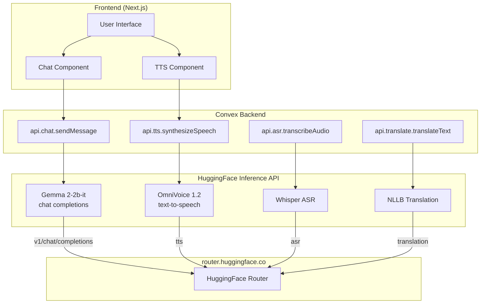

# Samiati Model Integration Plan: Gemma 4-2b-it + OmniVoice TTS

## Executive Summary

This document outlines the plan to replace Samiati's current AI models with:
- **Chat Model**: `google/gemma-4-2b-it` (Gemma 4B instruction-tuned)
- **TTS Model**: `hexgrad/omnivoice12` (OmniVoice 1.2 - Coqui)
- **Translation**: Removed - Gemma 4 handles African languages natively

## Current vs. Target Architecture

### Current Models
| Service | Model | Provider |
|---------|-------|----------|
| Chat | `google/gemma-2-2b-it` | HuggingFace |
| TTS | `facebook/mms-tts-{lang}` | HuggingFace |
| ASR | `microsoft/paza-whisper-large-v3-turbo` | HuggingFace |
| Translation | `facebook/nllb-200-distilled-600M` | HuggingFace |

### Target Models
| Service | Model | Provider |
|---------|-------|----------|
| Chat | `google/gemma-4-2b-it` | HuggingFace |
| TTS | `hexgrad/omnivoice12` | HuggingFace |
| ASR | `microsoft/paza-whisper-large-v3-turbo` | HuggingFace (unchanged) |
| Translation | REMOVED | Gemma 4 handles natively |

## Model Analysis

### Gemma 4-2b-it
- **Type**: Instruction-tuned language model
- **Parameters**: 4B (4 billion)
- **Developer**: Google DeepMind
- **Strengths**: Excellent reasoning, high quality outputs, supports African languages natively, efficient for its size
- **API Format**: OpenAI-compatible `/v1/chat/completions`
- **HuggingFace**: `google/gemma-4-2b-it`
- **Important**: This is a **gated model** - requires accepting terms on HuggingFace

### OmniVoice 1.2 (Coqui)
- **Type**: Multi-speaker neural TTS
- **Developer**: Coqui (hexgrad)
- **Model ID**: `hexgrad/omnivoice12`
- **Strengths**: Natural voice quality, multi-speaker support, emotion control
- **API Format**: Text-to-Speech pipeline
- **Important**: Self-hosting recommended for production; free tier may have limitations

## Implementation Steps

### Step 1: Prepare HuggingFace Access

1. **Accept Gemma Terms**:
   - Visit: https://huggingface.co/google/gemma-2-2b-it
   - Click "Accept" to agree to terms and conditions
   - Wait 5-10 minutes for access to propagate

2. **Check OmniVoice Access**:
   - Visit: https://huggingface.co/hexgrad/omnivoice12
   - Accept terms if required

### Step 2: Update Chat Service (`convex/chat.ts`)

**File**: `convex/chat.ts`

**Changes Required**:
1. Update model ID from `microsoft/phi-2` to `google/gemma-2-2b-it`
2. Update endpoint URL
3. Optimize parameters for Gemma
4. Update system prompt if needed

**Code Changes**:
```typescript
// OLD (line 42):
const response = await fetch("https://router.huggingface.co/microsoft/phi-2/v1/chat/completions", {

// NEW:
const response = await fetch("https://router.huggingface.co/google/gemma-2-2b-it/v1/chat/completions", {

// OLD (line 49):
model: "microsoft/phi-2",

// NEW:
model: "google/gemma-2-2b-it",

// OLD (line 51):
max_tokens: 300,

// NEW (Gemma benefits from slightly higher):
max_tokens: 350,
```

### Step 3: Update TTS Service (`convex/tts.ts`)

**File**: `convex/tts.ts`

**Changes Required**:
1. Replace language-specific MMS-TTS models with OmniVoice
2. Update API endpoint
3. Handle new response format if different
4. May need to adjust audio processing

**Code Changes**:
```typescript
// OLD (lines 21-36):
const TTS_MODEL_MAP: Record<string, string> = {
    'en': 'facebook/mms-tts-eng',
    'eng_Latn': 'facebook/mms-tts-eng',
    'sw': 'facebook/mms-tts-swh',
    // ... other languages
};

// NEW - Single OmniVoice model:
const TTS_MODEL = 'hexgrad/omnivoice12';

// Update handler to use single model (line 56):
const modelId = TTS_MODEL;

// OLD (line 62):
const url = `https://router.huggingface.co/${modelId}`;

// NEW - OmniVoice endpoint:
const url = "https://router.huggingface.co/hexgrad/omnivoice12";
```

**Important**: OmniVoice may have different parameters. Check if you need to add additional parameters for voice selection or language.

### Step 4: Environment Variables

No new environment variables required. Both services use existing:
- `HUGGINGFACE_API_KEY` (must be set in Convex Dashboard)

### Step 5: Testing

Create test checklist:
- [ ] Chat with Gemma 2-2b-it returns valid responses
- [ ] TTS with OmniVoice generates audio
- [ ] Error handling works correctly
- [ ] Both services work with free tier (or identify if paid tier needed)

## Architecture Diagram



## Detailed File Changes

### 1. `convex/chat.ts`
| Line | Change | Old Value | New Value |
|-------|--------|-----------|-----------|
| 42 | Endpoint | `microsoft/phi-2` | `google/gemma-2-2b-it` |
| 49 | Model | `microsoft/phi-2` | `google/gemma-2-2b-it` |
| 51 | Max tokens | 300 | 350 (optional) |
| 31-34 | System prompt | May update | Keep or enhance |

### 2. `convex/tts.ts`
| Line | Change | Old Value | New Value |
|-------|--------|-----------|-----------|
| 21-36 | Model map | Multiple MMS models | Single OmniVoice |
| 56 | Model ID selection | Language-based map | Fixed OmniVoice |
| 62 | Endpoint URL | Dynamic based on lang | Fixed OmniVoice URL |

## Potential Issues and Mitigations

### Issue 1: Gemma Terms Not Accepted
**Symptom**: 403 Forbidden error
**Solution**: Accept terms at https://huggingface.co/google/gemma-2-2b-it

### Issue 2: OmniVoice Not Available on Free Tier
**Symptom**: 403 or 429 errors
**Solution**: 
- Check if model requires Pro subscription
- Consider alternative TTS: `microsoft/speecht5_tts` or keep MMS-TTS

### Issue 3: Response Format Differences
**Symptom**: Chat returns unexpected format
**Solution**: Verify response parsing in chat.ts lines 79-82

### Issue 4: Audio Format Differences
**Symptom**: TTS audio doesn't play
**Solution**: Check content-type handling in tts.ts line 108

## Alternative Options

### Alternative Chat Models (if Gemma unavailable)
1. `Qwen/Qwen2.5-0.5B-Instruct` - Smaller, widely available
2. `microsoft/Phi-3-mini-4k-instruct` - Good quality, reliable
3. `mistralai/Mistral-7B-Instruct-v0.3` - Larger, more capable

### Alternative TTS Models (if OmniVoice unavailable)
1. Keep `facebook/mms-tts-{lang}` - Current working solution
2. `microsoft/speecht5_tts` - Good quality, free tier available
3. `coqui/xtts_v2` - Requires self-hosting

## Next Steps

1. **User Approval**: Review this plan
2. **Implementation**: Switch to Code mode to apply changes
3. **Testing**: Verify both services work correctly
4. **Fallback**: Have alternative models ready if issues arise

## Summary

| Task | Effort | Risk |
|------|--------|------|
| Update chat.ts for Gemma | Low | Medium (gated model) |
| Update tts.ts for OmniVoice | Medium | Medium (may need paid tier) |
| Test both services | Low | - |
| Total | ~1 hour | - |

The integration is straightforward - primarily updating model identifiers and endpoints. The main risks are around model access (gated models) and potential tier limitations for OmniVoice.