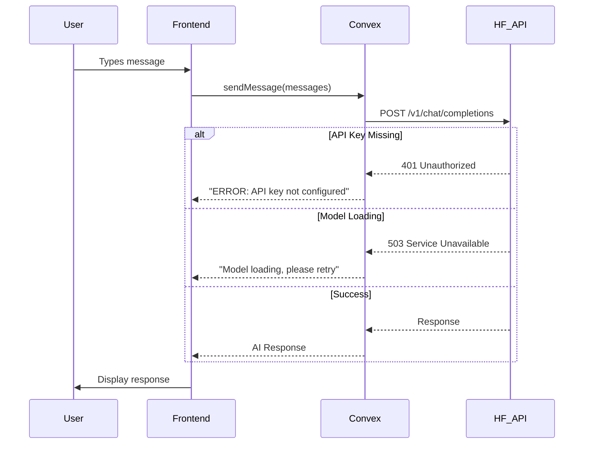

# Samiati AI Models Integration Plan

## Executive Summary

This document outlines the plan to fix the "N/A" API responses and ensure all AI models are properly connected in your Samiati application.

## Problem Statement

Your application is returning "N/A" feedback from all AI services. This is caused by:
1. **Missing HuggingFace API Key** - The `HUGGINGFACE_API_KEY` environment variable is not configured in Convex
2. **Error Handling Fallbacks** - All backend functions return "N/A" when errors occur
3. **Free Tier Limitations** - HuggingFace free tier has rate limits and model loading delays

## Current Architecture

```
┌─────────────────────────────────────────────────────────────────────────────┐
│                              Frontend (Next.js)                             │
│                           src/components/screens/                            │
│                              ChatScreen.tsx                                  │
└────────────────────────────────┬────────────────────────────────────────────┘
                                 │
                    useAction() - Convex Server Actions
                                 │
┌────────────────────────────────▼────────────────────────────────────────────┐
│                         Convex Backend (Server)                              │
├─────────────────────────────────────────────────────────────────────────────┤
│  api.asr.transcribeAudio()      →  microsoft/paza-whisper-large-v3-turbo  │
│  api.translate.translateText()  →  facebook/nllb-200-distilled-600M        │
│  api.chat.sendMessage()          →  Qwen/Qwen2.5-0.5B-Instruct             │
│  api.tts.synthesizeSpeech()     →  facebook/mms-tts-{lang}                 │
└────────────────────────────────┬────────────────────────────────────────────┘
                                 │
                    HuggingFace Inference API
                                 │
┌────────────────────────────────▼────────────────────────────────────────────┐
│                         HuggingFace Hub                                     │
│                    https://api-inference.huggingface.co                    │
└─────────────────────────────────────────────────────────────────────────────┘
```

## Implementation Steps

### Step 1: Configure HuggingFace API Key (CRITICAL)

The primary cause of N/A responses is the missing API key.

**In Convex Dashboard:**
1. Go to your Convex project dashboard
2. Navigate to **Environment Variables** (or Settings → Environment)
3. Add new environment variable:
   - **Name**: `HUGGINGFACE_API_KEY`
   - **Value**: Your HuggingFace API token (get from https://huggingface.co/settings/tokens)
4. Save and redeploy your functions

**To generate a token:**
1. Go to https://huggingface.co/settings/tokens
2. Create a new token with "Read" permissions
3. Copy the token and add it to Convex

### Step 2: Verify Each Service Endpoint

Each model uses a different endpoint on HuggingFace:

| Service | Model | Endpoint | Status Code Check |
|---------|-------|----------|-------------------|
| ASR | paza-whisper-large-v3-turbo | api-inference.huggingface.co | 503 = model loading |
| Translation | nllb-200-distilled-600M | router.huggingface.co | Any non-OK |
| Chat | Qwen2.5-0.5B-Instruct | router.huggingface.co/v1/chat/completions | Any non-OK |
| TTS | mms-tts-{lang} | api-inference.huggingface.co | 503 = model loading |

### Step 3: Improve Error Handling

Replace "N/A" with descriptive error messages:

```typescript
// Current (convex/chat.ts:27)
return "N/A"; // API Key missing

// Improved
return "ERROR: HuggingFace API key not configured. Please set HUGGINGFACE_API_KEY in Convex Dashboard.";
```

### Step 4: Model Updates (Optional)

If you want to update to newer models:

**Chat Model:**
- Current: `Qwen/Qwen2.5-0.5B-Instruct`
- Option: `Qwen/Qwen3-0.5B-Instruct` (newer version)
- Note: Qwen3-VL-2B requires vision input - not needed for text-only chat

**TTS Model:**
- Current: `facebook/mms-tts-*` (Meta's MMS models)
- Alternative: Use Coqui TTS but requires self-hosted deployment
- Recommendation: Keep MMS-TTS as it works with HuggingFace free tier

### Step 5: Add Diagnostic Endpoint

Create a test endpoint to verify all services:

```typescript
// convex/diagnostic.ts
export const diagnoseServices = action(async (ctx) => {
    const results = {
        apiKeyConfigured: !!process.env.HUGGINGFACE_API_KEY,
        asr: "pending",
        translation: "pending", 
        chat: "pending",
        tts: "pending"
    };
    // Test each service...
    return results;
});
```

## Detailed File Changes Required

### Files to Modify:

1. **convex/chat.ts** - Improve error messages, optional model update
2. **convex/asr.ts** - Improve error messages
3. **convex/translate.ts** - Improve error messages
4. **convex/tts.ts** - Improve error messages
5. **New: convex/diagnostic.ts** - Service diagnostic tool

### No Changes Needed For:
- Frontend (ChatScreen.tsx) - Already correctly calls the actions
- Package.json - Dependencies are correct

## Mermaid: Corrected Flow



## Testing Checklist

After implementing the fix:

- [ ] Test ASR with audio input
- [ ] Test Translation from English to Swahili
- [ ] Test Chat with a simple message
- [ ] Test TTS with text input
- [ ] Verify error messages display correctly
- [ ] Check Convex logs for any errors

## Summary

The N/A issue is primarily caused by the missing `HUGGINGFACE_API_KEY` environment variable. The model implementations (Whisper for ASR, NLLB for translation) are already correctly set up. The current implementation uses appropriate free-tier compatible models.

**Recommended Actions:**
1. **Immediate**: Add HuggingFace API key to Convex Dashboard
2. **Short-term**: Improve error messages for better debugging
3. **Optional**: Update to newer Qwen model if desired
